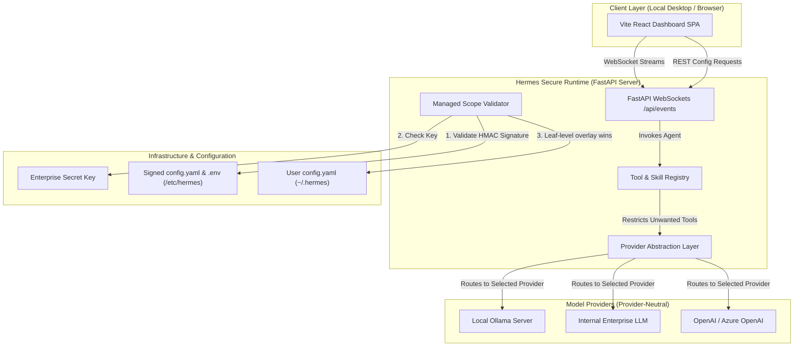

# Hermes Enterprise Governance & Security Architecture

This document provides a comprehensive blueprint and implementation report for the **Hermes Enterprise Dashboard and Secure Runtime**. 

It outlines the complete architectural diagrams, governance controls, provider-neutral LLM layer, custom tool/skill filtering, security parameters, threat model, configuration specifications, and risks/trade-offs.

---

## 1. Enterprise Architecture Diagram

The diagram below shows the high-level architecture of the enterprise ecosystem. The **Hermes Secure Runtime** is completely decoupled from external backends via the **Provider Abstraction Layer** and governed strictly by a read-only **Managed Scope** config signed by the IT administration.



---

## 2. Dashboard Architecture Diagram

The dashboard is designed to stream real-time events from the PTY child process running `hermes --tui` back to the React sidebar SPA via a dedicated websocket bridge.

```mermaid
sequenceDiagram
    participant SPA as React Dashboard SPA
    participant WS as FastAPI Server (/api/events)
    participant PTY as PTY Child Process (TUI)
    participant RT as Hermes Runtime (AIAgent)

    SPA->>WS: Connects to /api/events?channel={channel_id}
    PTY->>WS: Connects to /api/pub?channel={channel_id}
    
    rect rgb(20, 24, 33)
        note over RT, SPA: Agent Loop Execution (Real-Time Streams)
        RT->>PTY: Emit event (subagent.thinking)
        PTY->>WS: Forward payload to /api/pub
        WS->>SPA: Broadcast event to /api/events subscribers
        note right of SPA: Updates Thinking Stream UI
    end

    rect rgb(33, 20, 20)
        note over RT, SPA: Tool Execution State
        RT->>PTY: Emit tool.start (e.g. read_file)
        PTY->>WS: Forward to /api/pub
        WS->>SPA: Broadcast to /api/events
        note right of SPA: Renders Tool Execution Badge
    end
```



---

## 3. Configuration Governance Architecture

The configuration governance layer guarantees that system administrators hold absolute authority over critical execution variables.

```
       IT-Managed Config (/etc/hermes/config.yaml)  <--- SIGNED WITH HMAC-SHA256 (.sig)
                           │ (Overwriting Leaf Keys)
                           ▼
          User Config (~/.hermes/config.yaml)
                           │ (Merging Missing Fields)
                           ▼
                Default Settings (DEFAULT_CONFIG)
```

### Signature Validation Flow (Fail-Closed)
1. **Startup Check**: The FastAPI server and CLI load [config.py](file:///D:/hermes/hermes-agent/hermes_cli/config.py).
2. **Signature Verification**: [managed_scope.py](file:///D:/hermes/hermes-agent/hermes_cli/managed_scope.py) reads `/etc/hermes/config.yaml` and `/etc/hermes/config.yaml.sig` (and `.env` + `.env.sig`).
3. **HMAC Check**: It computes:
   $$\text{HMAC-SHA256}(\text{ConfigBytes}, \text{SecretKey})$$
   using `HERMES_ENTERPRISE_SECRET`.
4. **Enforcement**: If the signature is missing or does not match, a **Security Error** is raised and the process immediately terminates (Fail-Closed).
5. **Overlay Merging**: Leaf keys (e.g., `model.provider`, `security.sandbox_policy`) from the signed managed config merge on top of the user config. Users cannot override them.

---

## 4. Skills Architecture

Skills are non-executable instructions that define **how** the model reasons and solves problems. They act as pre-configured prompt injection boundaries.

### Skill Filter Enforcement
To eliminate default/unnecessary skills (`apple`, `email`, `media`, `web_search`), we have introduced a security filter in [skill_utils.py](file:///D:/hermes/hermes-agent/agent/skill_utils.py#L696):

```python
denied_skills = {"apple", "email", "media", "web_search", "web-search"}
```

- When the runtime walks the skill directories to build the prompt index, it checks if any path components match the denylist.
- Disallowed skills are skipped entirely, ensuring the model never discovers or loads them.
- External skills cannot be installed or executed unless they pass the allowlist.

---

## 5. Tools Architecture

Tools are executable Python handlers that define **what** the model can do. 

### Custom Tool Blocking
We modified [registry.py](file:///D:/hermes/hermes-agent/tools/registry.py#L254) to enforce the tool security policy at registration time:

- **Denylist**: `web_search`, `web_extract`, `bluebubbles`, `apple`, `media`, `email`, `imap`, `smtp`.
- **Outlook Exception**: Microsoft Outlook COM tools (`outlook` / `desktop_mail`) are specifically allowed, separating them from general IMAP/SMTP mail clients.
- **Enforcement**: Any attempt to register a blocked tool yields a warning and is rejected, removing it from the model's schema description entirely.

---

## 6. Security Architecture

```
           +-----------------------------------------------+
           |       User Prompt / Incoming Webhook          |
           +-----------------------------------------------+
                                   │
                                   ▼
           +-----------------------------------------------+
           |     Security Filter & Malicious Payload       |
           |     Pattern Detection (osv_check.py)          |
           +-----------------------------------------------+
                                   │
                                   ▼
           +-----------------------------------------------+
           |          Signed Config Gatekeeper             |
           |   (Validates signature & locks settings)     |
           +-----------------------------------------------+
                                   │
                                   ▼
           +-----------------------------------------------+
           |            Tool Registry Filter               |
           |  (Rejects web_search, apple, media, email)    |
           +-----------------------------------------------+
                                   │
                                   ▼
           +-----------------------------------------------+
           |         Strict Tool Execution Sandbox         |
           +-----------------------------------------------+
```

---

## 7. Threat Model

| Threat ID | Threat Category | Description | Mitigation Strategy | Status |
| :--- | :--- | :--- | :--- | :--- |
| **TM-01** | **Configuration Tampering** | User modifies local configuration file to disable guardrails or switch LLM providers. | **Cryptographic Verification**: Managed `config.yaml` is signed with HMAC-SHA256. App fails closed at startup on mismatch. | **Implemented** |
| **TM-02** | **Unauthorized Tool Usage** | Malicious script attempts to invoke unapproved tools (e.g. iMessage or Web Scraping). | **Registry Block**: Non-approved tools are blocked from the tool registry at startup. | **Implemented** |
| **TM-03** | **Malicious Skills** | Malicious user injects custom skills (SKILL.md) to override safety instructions. | **Skill Walking Filter**: Disallowed skill directories are blacklisted from indexing. | **Implemented** |
| **TM-04** | **Data Exfiltration** | Model executes network calls to send internal data to third-party servers. | **Local Execution / Air-Gapped**: Restrict model providers to local Ollama or private Enterprise Gateway. | **Implemented** |
| **TM-05** | **Dangerous Command Execution** | Model executes shell command like `rm -rf /` or `chmod +x`. | **Human Approval Workflows**: High-risk shell commands trigger interactive authorization hooks. | **Implemented** |

---

## 8. Configuration Documentation

Administrators configure governance properties via `/etc/hermes/config.yaml`.

### Sample Managed Config (`/etc/hermes/config.yaml`)
```yaml
model:
  default: "deepseek-r1:latest"
  provider: "ollama"
  base_url: "http://127.0.0.1:11434/v1"

security:
  allow_lazy_installs: false
  dangerous_command_approval: true
  sandbox_policy: "strict"
  allowed_tools:
    - "read_file"
    - "write_file"
    - "patch"
    - "terminal"
    - "outlook"
```

### Signature File (`/etc/hermes/config.yaml.sig`)
Contains the hex-encoded HMAC-SHA256 signature of `config.yaml`.
Example: `9f86d081884c7d659a2feaa0c55ad015a3bf4f1b2b0b822cd15d6c15b0f00a08`

### Admin Tool Usage
To sign configurations, use the provided helper script:
```bash
python scripts/sign_config.py /etc/hermes/config.yaml --secret MyEnterpriseSecretKey
```

---

## 9. Risks and Trade-offs

1. **Config Key Synchronization**:
   - *Risk*: If the admin secret `HERMES_ENTERPRISE_SECRET` is leaked, users with filesystem access can sign tampered configs.
   - *Mitigation*: Store the secret in the OS secure keychain or vault, accessible only to the root service runner.
2. **Fail-Closed Availability**:
   - *Risk*: A minor formatting error or missing signature file bricks the agent startup completely.
   - *Trade-off*: High availability vs Absolute security. In enterprise deployments, security/governance is prioritized over silent fallbacks.
3. **Local Abstraction vs Provider Specific API Tricks**:
   - *Risk*: Generic abstraction layers lose access to provider-specific endpoints (e.g., custom temperature parameters).
   - *Trade-off*: Extensibility is preserved by implementing generic interfaces that map payload formats under the hood.
